# M2A23BSP_ISP_CAN_APROM

M2A23 BSP example for:

- Boot loader in `LDROM` using `Classical CAN` ISP
- Application code in `APROM`
- Application checksum generated by `SRecord`

Update: `2026/05/06`

## Overview

This project is split into 2 parts:

- `ISP_CAN`
  Boot loader in `LDROM 4KB`
- `AP`
  Application code in `APROM 64KB`

Current flash map:

| Region | Address | Size | Note |
| --- | --- | --- | --- |
| LDROM boot code | `0x00100000 ~ 0x00100FFF` | `4KB` | CAN ISP boot loader |
| AP code | `0x00000000 ~ 0x0000FFFF` | `64KB` | SRecord fills binary to full app size |
| APP checksum | `0x0000FFFC` | `4 bytes` | Last 4 bytes of AP image |

Related settings:

- Flash layout runtime constants:
  [memory_map.h](SampleCode/Template/memory_map.h)
- AP checksum / output size:
  [checksum_config.cmd](SampleCode/Template/AP/Keil/checksum_config.cmd)

## Boot Code

Boot project: `SampleCode/Template/ISP_CAN`

Boot behavior:

- Power-on enters `LDROM`
- Boot checks whether APP is valid
- Validation includes:
  - stack pointer range
  - reset vector range / thumb bit
  - checksum field is not `0xFFFFFFFF` and not `0x00000000`
  - calculate `CRC32` over `APP_START_ADDR` to `APP_SIZE_BYTES - 4`
- If APP is valid:
  jump to APP immediately
- If APP is invalid:
  stay in boot loader and wait for CAN ISP commands

Current boot debug messages:

- Normal boot:
  - `[boot]boot start`
  - `[boot]valid,quick jump`
- Invalid APP:
  - `[boot]boot start`
  - `[boot]invalid,stay boot`
- Detailed invalid reasons when `BOOT_DEBUG_PRINT_CMD=1`:
  - `[boot]IV2-...` invalid reset vector
  - `[boot]IV3-...` empty / erased checksum field
  - `[boot]IV4-<calc>:<stored>` checksum mismatch

Current boot interfaces:

- UART debug:
  `UART0`, `PB12=RXD0`, `PB13=TXD0`
- CAN ISP:
  `CANFD0` in `Classical CAN mode`
  `PC4=CANFD0_RXD`, `PC5=CANFD0_TXD`

Screenshots:

Boot normal power-on:

Boot invalid checksum:

Boot after programming APP successfully:

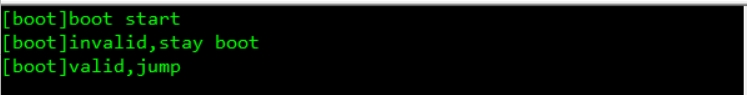

## ISP Flow

Boot loader uses Nuvoton ISP tool over CAN.

Recommended usage:

1. Program boot loader to `LDROM` first by ICP
2. Open `Nuvoton ISP tool`
3. Use `Nu-Link2 Pro` with CAN interface
4. Click `Connect`
5. Reset MCU
6. Download APP image by ISP tool

Notes for Nuvoton ISP tool + Nu-Link2 Pro:

- Boot loader side is `Classical CAN only`
- APP side can do `CAN FD` and `Classical CAN`
- Boot loader accepts ISP command via CAN and writes APROM
- During ISP update, boot debug may print:
  - received command
  - command data
  - flash readback data
- APP must contain valid checksum, otherwise boot will stay in ISP mode

Screenshots:

ISP tool connect:

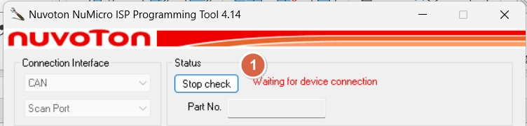

ISP tool operation step:

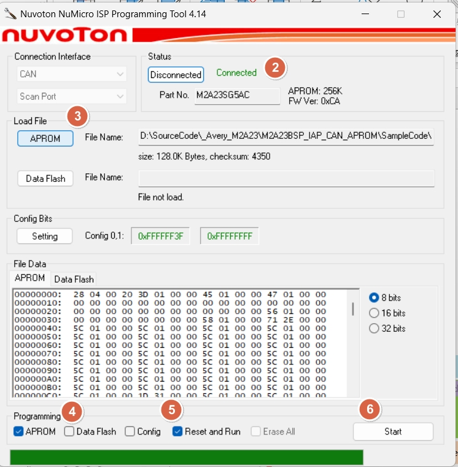

ISP tool during update:

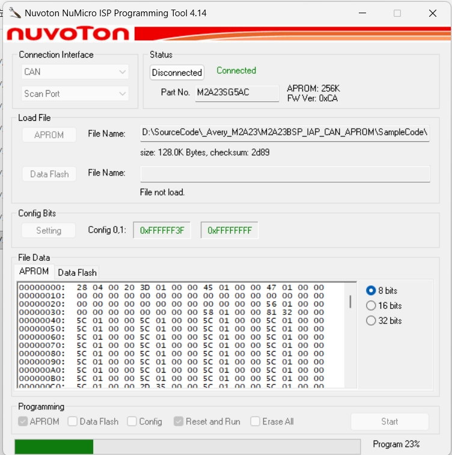

## ICP Notes

When programming boot code by ICP:

- Boot loader image goes to `LDROM`
- Boot source / config must allow boot from `LDROM with IAP`
- Confirm flash config before mass production

Reference pictures:

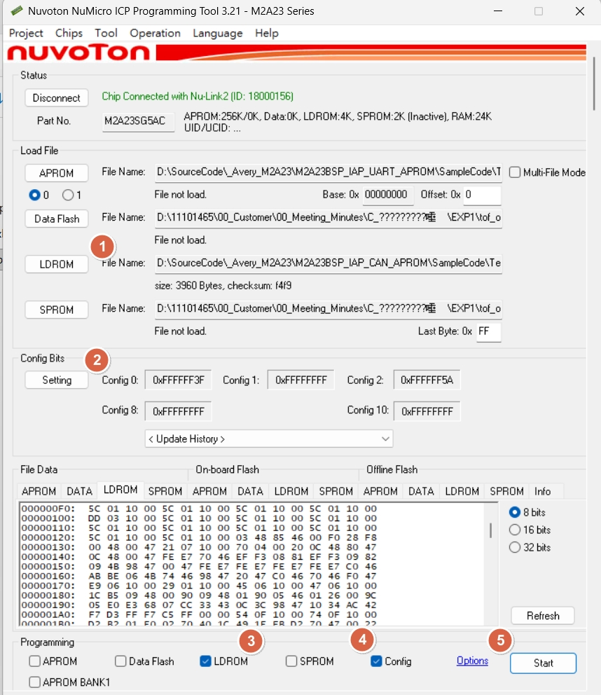

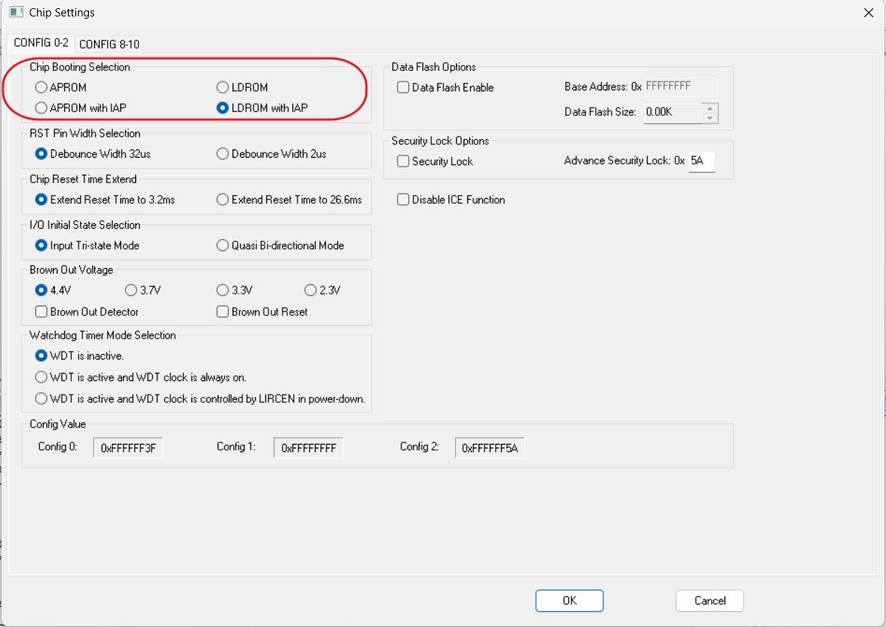

## App Code

Application project: `SampleCode/Template/AP`

### Hardware Pins

Application uses these pins:

- `UART0`
  `PB12=RXD0`, `PB13=TXD0`
- `CANFD0`
  `PC4=CANFD0_RXD`, `PC5=CANFD0_TXD`
- `CAN mode select`
  `PC3` output low
- `PWM0_CH0`
  `PB5`
- `PWM0_CH2`
  `PB3`
- `PWM0_CH4`
  `PB1`
- `LED`
  `PF14`

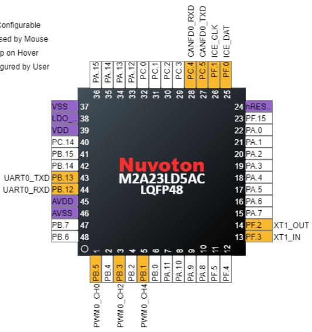

### Checksum by SRecord

AP image checksum is generated by `SRecord`.

Flow:

- Keil builds `APROM_application.axf`
- Post-build creates `APROM_application.bin`
- `generateChecksum.bat` calculates CRC32
- CRC32 is written to the last 4 bytes of the APP image
- Script also generates:
  `APROM_application_crc.hex`

Current checksum settings:

- APP start:
  `0x00000000`
- APP size:
  `0x00010000`
- CRC store address:
  `0x0000FFFC`

Files:

- [generateChecksum.bat](SampleCode/Template/AP/Keil/generateChecksum.bat)
- [checksum_config.cmd](SampleCode/Template/AP/Keil/checksum_config.cmd)

### Normal App Power-on

Typical APP startup log includes:

- `Reset Source <...>`
- `power on from ...`
- CAN mode / bitrate information
- PWM status
- UART key map

Screenshot:

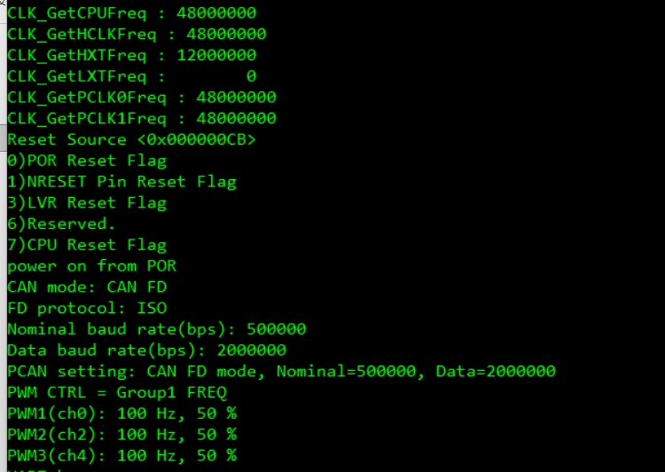

## App Functions

### PWM adjust

UART control:

- `1/2`
  select PWM1 `FREQ/DUTY`
- `3/4`
  select PWM2 `FREQ/DUTY`
- `5/6`
  select PWM3 `FREQ/DUTY`
- `A/a`
  increment selected item
- `D/d`
  decrement selected item

Result output:

- UART log prints current PWM group and value
- Scope capture can be used to verify duty

Images:

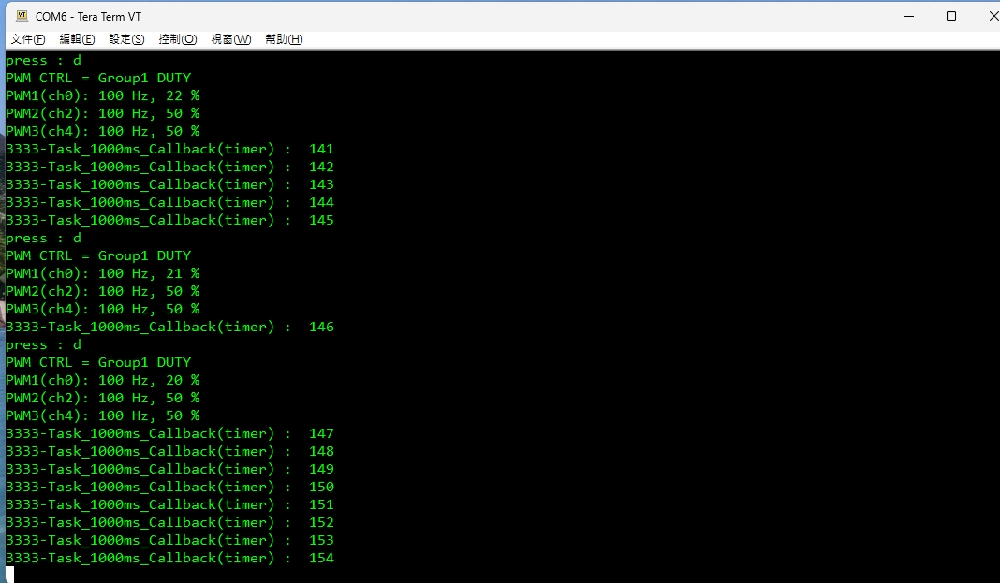

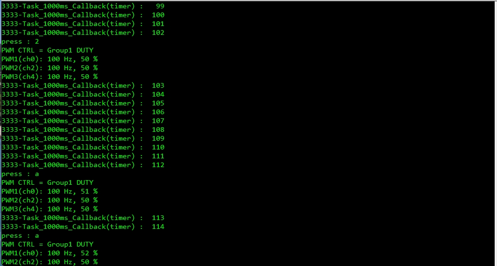

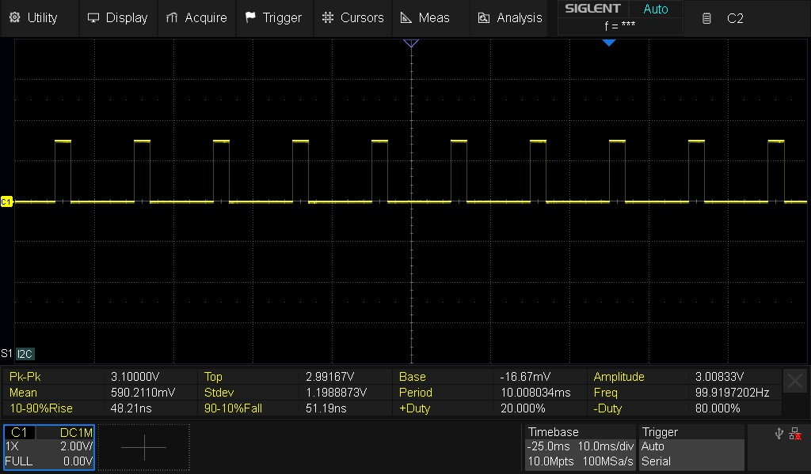

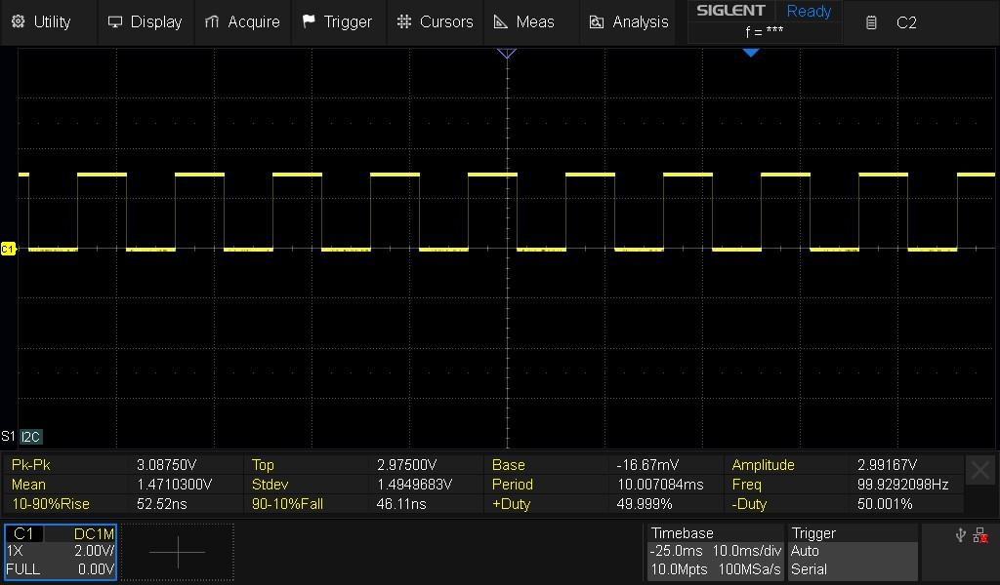

### CAN TX

UART control:

- `8`
  send CAN FD SID `0x333`, `16 bytes`
- `9`
  send CAN FD XID `0x4444`, `32 bytes`

Result output:

- UART log prints TX request information
- CAN analyzer / PCAN should be used to confirm bus traffic

Images:

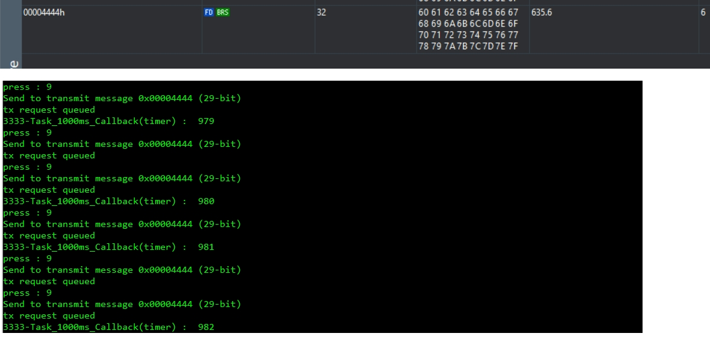

### CAN RX

Behavior:

- APP receives CAN / CAN FD message
- `CAN_Rx_process()` prints received ID, frame type and payload

Result output:

- UART log

Image:

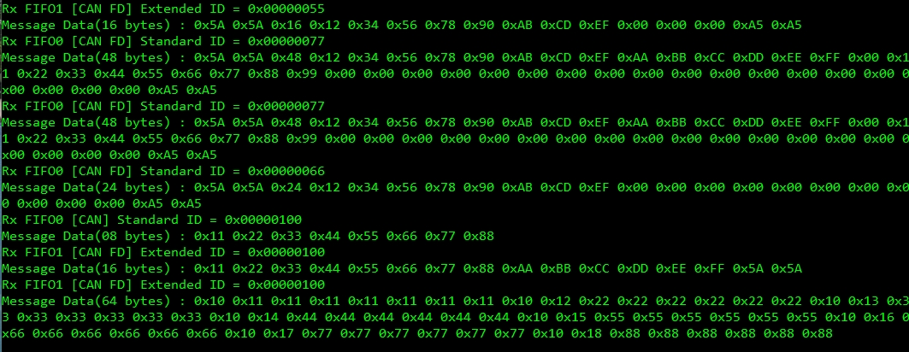

### Wake-up by CAN

UART control:

- `7`
  enter standby and wait for CAN wake-up

Behavior:

- APP enters standby
- CAN RX IRQ wakes MCU
- Wake-up result is printed on UART

Image:

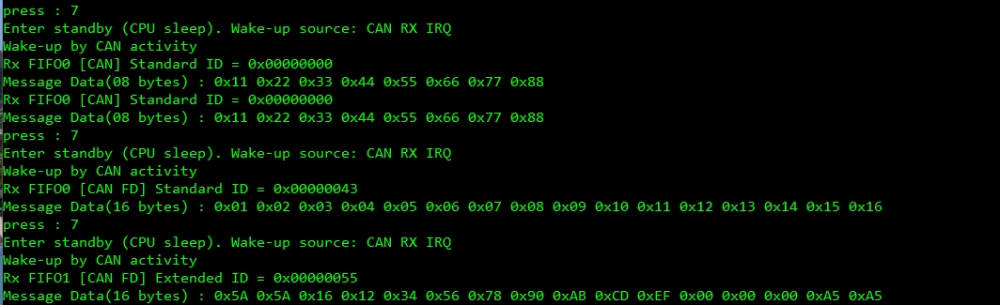

### Erase checksum

UART control:

- `E/e`
  erase APP checksum and reset

Behavior:

- APP writes `0x00000000` to checksum field
- After reset, boot loader detects invalid APP and stays in ISP mode

Image:

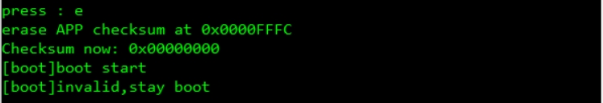

## If App Size Changes

If APP size or checksum location must be changed later, update these places together:

1. [memory_map.h](SampleCode/Template/memory_map.h)
   update `APROM_SIZE_BYTES`, `APP_END_ADDR`, `APP_CHECKSUM_ADDR`
2. [checksum_config.cmd](SampleCode/Template/AP/Keil/checksum_config.cmd)
   update `APROM_SIZE`, `APP_SIZE`, `CRC_ADDR`

Do not update only one side. Boot validation range and post-build checksum range must stay consistent.

## Boot Flow

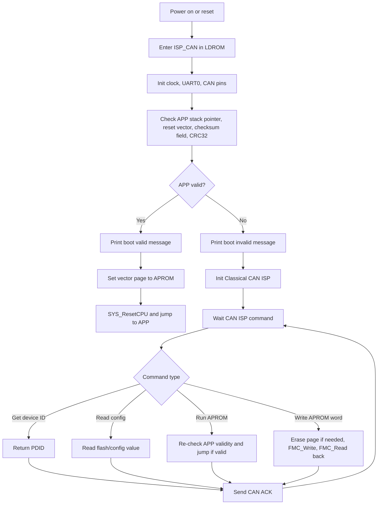
